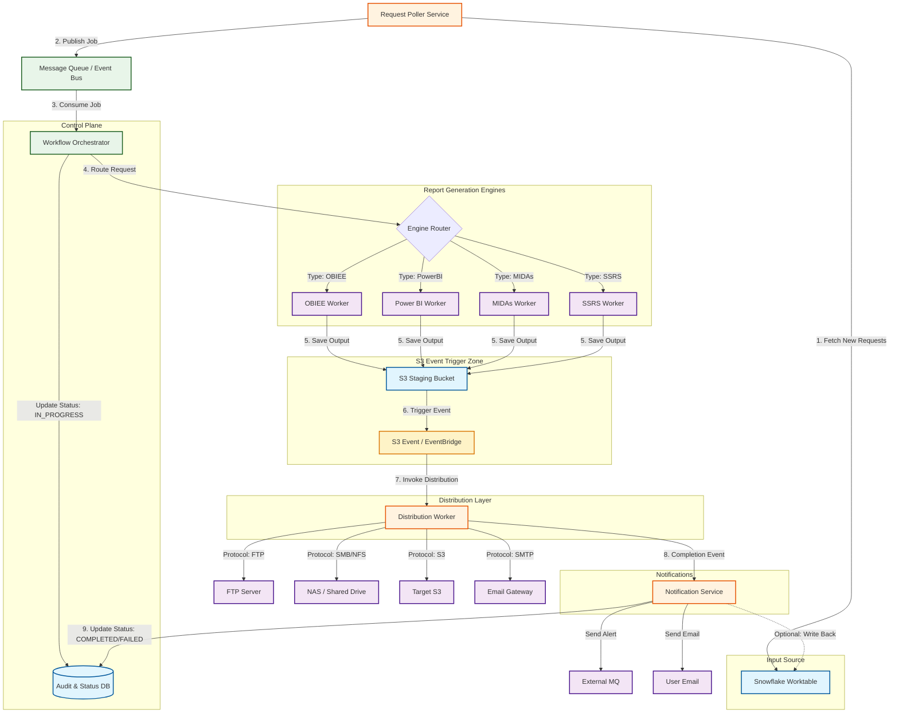

# Enterprise Reporting Solution

An event-driven, scalable reporting platform that orchestrates report generation across multiple engines and distributes outputs to various destinations.

## Architecture Overview



## Components

### Input Layer

| Component | Description |
|-----------|-------------|
| **Snowflake Worktable** | Central request queue where report generation requests are submitted. Contains report metadata, parameters, and distribution configuration. |

### Control Plane

| Component | Description |
|-----------|-------------|
| **Request Poller Service** | Polls Snowflake worktable for new requests and publishes jobs to the message queue. |
| **Message Queue (Kafka/SQS)** | Decouples request intake from processing. Provides durability and replay capability. |
| **Workflow Orchestrator** | Core engine that routes requests to appropriate report engines and manages workflow state. |
| **Audit & Status DB** | Tracks status of every request through its lifecycle with full audit trail. |

### Report Generation Engines

| Engine | Use Case |
|--------|----------|
| **OBIEE Worker** | Oracle BI Publisher reports, complex enterprise reports |
| **Power BI Worker** | Microsoft Power BI paginated reports and exports |
| **MIDAs Worker** | Custom internal reporting engine |
| **SSRS Worker** | SQL Server Reporting Services reports |
| **Python Worker** | Custom scripts for data exports and specialized reports |

### S3 Event Trigger Zone

| Component | Description |
|-----------|-------------|
| **S3 Staging Bucket** | Temporary storage for generated reports before distribution |
| **S3 Event / EventBridge** | Triggers distribution automatically when files land in staging bucket |

### Distribution Layer

| Target | Protocol | Use Case |
|--------|----------|----------|
| **FTP/SFTP Server** | FTP/SFTP | External partner delivery |
| **NAS / Shared Drive** | SMB/NFS | Internal network storage |
| **Target S3** | S3 API | Cloud storage destinations |
| **Email Gateway** | SMTP/SES | Direct email delivery with attachments |

### Notification Layer

| Channel | Description |
|---------|-------------|
| **External MQ** | Publish completion events for downstream systems |
| **User Email** | Send status notifications to stakeholders |

## Workflow

```
┌─────────────────────────────────────────────────────────────────────────────┐
│                           REQUEST LIFECYCLE                                  │
├─────────────────────────────────────────────────────────────────────────────┤
│                                                                             │
│  ┌──────────┐    ┌──────────┐    ┌──────────┐    ┌──────────┐              │
│  │ PENDING  │───▶│IN_PROGRESS│───▶│GENERATED │───▶│DISTRIBUTED│             │
│  └──────────┘    └──────────┘    └──────────┘    └──────────┘              │
│       │              │                │               │                     │
│       │              │                │               ▼                     │
│       │              │                │         ┌──────────┐               │
│       │              │                │         │COMPLETED │               │
│       │              │                │         └──────────┘               │
│       │              │                │               │                     │
│       ▼              ▼                ▼               ▼                     │
│  ┌─────────────────────────────────────────────────────────┐               │
│  │                      FAILED                              │               │
│  │            (with retry queue & error logs)               │               │
│  └─────────────────────────────────────────────────────────┘               │
│                                                                             │
└─────────────────────────────────────────────────────────────────────────────┘
```

### Step-by-Step Flow

1. **Request Submission** - Report request inserted into Snowflake worktable
2. **Job Publishing** - Poller service fetches request and publishes to message queue
3. **Job Consumption** - Orchestrator consumes job and updates status to `IN_PROGRESS`
4. **Engine Routing** - Request routed to appropriate report engine based on type
5. **Report Generation** - Engine generates report and saves to S3 staging bucket
6. **Event Trigger** - S3 event notification fires when file lands
7. **Distribution** - Distribution worker triggered, delivers to configured destinations
8. **Notification** - Completion events sent to MQ and email notifications dispatched
9. **Status Update** - Final status (`COMPLETED`/`FAILED`) written to Audit DB

## Database Schema

### Snowflake Tables

```sql
-- Request Worktable
CREATE TABLE REPORT_REQUESTS (
    REQUEST_ID VARCHAR(36) PRIMARY KEY,
    REPORT_TYPE VARCHAR(50) NOT NULL,           -- OBIEE, POWERBI, MIDAS, SSRS
    REPORT_NAME VARCHAR(255) NOT NULL,
    PARAMETERS VARIANT,                          -- JSON parameters
    DISTRIBUTION_CONFIG VARIANT,                 -- JSON distribution targets
    PRIORITY INT DEFAULT 5,
    REQUESTED_BY VARCHAR(100),
    REQUESTED_AT TIMESTAMP_NTZ DEFAULT CURRENT_TIMESTAMP(),
    STATUS VARCHAR(20) DEFAULT 'PENDING',
    PROCESSED_AT TIMESTAMP_NTZ,
    COMPLETED_AT TIMESTAMP_NTZ
);

-- Distribution Configuration
CREATE TABLE DISTRIBUTION_CONFIG (
    CONFIG_ID VARCHAR(36) PRIMARY KEY,
    REQUEST_ID VARCHAR(36) REFERENCES REPORT_REQUESTS(REQUEST_ID),
    TARGET_TYPE VARCHAR(20) NOT NULL,           -- FTP, NAS, S3, EMAIL
    TARGET_PATH VARCHAR(500),
    CREDENTIALS_SECRET VARCHAR(100),            -- AWS Secrets Manager reference
    ENABLED BOOLEAN DEFAULT TRUE
);

-- Audit Log
CREATE TABLE AUDIT_LOG (
    LOG_ID VARCHAR(36) PRIMARY KEY,
    REQUEST_ID VARCHAR(36),
    EVENT_TYPE VARCHAR(50),                     -- STATUS_CHANGE, ERROR, DISTRIBUTION, etc.
    EVENT_TIMESTAMP TIMESTAMP_NTZ DEFAULT CURRENT_TIMESTAMP(),
    OLD_STATUS VARCHAR(20),
    NEW_STATUS VARCHAR(20),
    DETAILS VARIANT,
    COMPONENT VARCHAR(50)                       -- POLLER, ORCHESTRATOR, ENGINE, DISTRIBUTOR
);

-- Error Log
CREATE TABLE ERROR_LOG (
    ERROR_ID VARCHAR(36) PRIMARY KEY,
    REQUEST_ID VARCHAR(36),
    ERROR_TIMESTAMP TIMESTAMP_NTZ DEFAULT CURRENT_TIMESTAMP(),
    ERROR_CODE VARCHAR(50),
    ERROR_MESSAGE TEXT,
    STACK_TRACE TEXT,
    COMPONENT VARCHAR(50),
    RETRY_COUNT INT DEFAULT 0,
    RETRY_ELIGIBLE BOOLEAN DEFAULT TRUE
);
```

## AWS Infrastructure

### S3 Event Configuration

```yaml
# EventBridge Rule for S3 Events
AWSTemplateFormatVersion: '2010-09-09'
Description: S3 Event Trigger for Distribution Worker

Resources:
  ReportStagingBucket:
    Type: AWS::S3::Bucket
    Properties:
      BucketName: !Sub '${AWS::StackName}-report-staging'
      NotificationConfiguration:
        EventBridgeConfiguration:
          EventBridgeEnabled: true

  DistributionEventRule:
    Type: AWS::Events::Rule
    Properties:
      Name: report-distribution-trigger
      Description: Trigger distribution when report lands in staging
      EventPattern:
        source:
          - aws.s3
        detail-type:
          - Object Created
        detail:
          bucket:
            name:
              - !Ref ReportStagingBucket
          object:
            key:
              - prefix: 'reports/'
      State: ENABLED
      Targets:
        - Id: DistributionWorkerTarget
          Arn: !GetAtt DistributionWorkerLambda.Arn

  DistributionWorkerLambda:
    Type: AWS::Lambda::Function
    Properties:
      FunctionName: distribution-worker
      Runtime: python3.11
      Handler: handler.lambda_handler
      Timeout: 300
      MemorySize: 512
      Environment:
        Variables:
          AUDIT_DB_SECRET: !Ref AuditDBSecret
          NOTIFICATION_TOPIC: !Ref NotificationTopic
```

### IAM Roles

```yaml
  DistributionWorkerRole:
    Type: AWS::IAM::Role
    Properties:
      AssumeRolePolicyDocument:
        Version: '2012-10-17'
        Statement:
          - Effect: Allow
            Principal:
              Service: lambda.amazonaws.com
            Action: sts:AssumeRole
      Policies:
        - PolicyName: DistributionWorkerPolicy
          PolicyDocument:
            Version: '2012-10-17'
            Statement:
              - Effect: Allow
                Action:
                  - s3:GetObject
                  - s3:PutObject
                  - s3:DeleteObject
                Resource:
                  - !Sub '${ReportStagingBucket.Arn}/*'
                  - !Sub 'arn:aws:s3:::${TargetBucket}/*'
              - Effect: Allow
                Action:
                  - secretsmanager:GetSecretValue
                Resource: '*'
              - Effect: Allow
                Action:
                  - sns:Publish
                Resource: !Ref NotificationTopic
```

## Configuration

### Environment Variables

```bash
# Snowflake Connection
SNOWFLAKE_ACCOUNT=your_account
SNOWFLAKE_USER=service_user
SNOWFLAKE_WAREHOUSE=REPORTING_WH
SNOWFLAKE_DATABASE=REPORTING_DB
SNOWFLAKE_SCHEMA=PUBLIC

# AWS Configuration
AWS_REGION=us-east-1
STAGING_BUCKET=report-staging-bucket
TARGET_BUCKET=report-archive-bucket

# Message Queue
KAFKA_BOOTSTRAP_SERVERS=kafka:9092
KAFKA_TOPIC=report-requests

# Notification
SMTP_HOST=email-smtp.us-east-1.amazonaws.com
SMTP_PORT=587
NOTIFICATION_EMAIL=reports@company.com
```

### Report Engine Configuration

```yaml
# config/engines.yaml
engines:
  obiee:
    endpoint: https://obiee.internal.company.com/xmlpserver
    auth_type: basic
    timeout_seconds: 300
    retry_count: 3
    
  powerbi:
    tenant_id: ${AZURE_TENANT_ID}
    client_id: ${POWERBI_CLIENT_ID}
    workspace_id: ${POWERBI_WORKSPACE_ID}
    auth_type: service_principal
    
  midas:
    endpoint: https://midas.internal.company.com/api/v1
    auth_type: api_key
    api_key_secret: midas-api-key
    
  ssrs:
    endpoint: https://ssrs.internal.company.com/ReportServer
    auth_type: ntlm
    timeout_seconds: 600
```

## Monitoring & Alerting

### CloudWatch Metrics

| Metric | Description | Alarm Threshold |
|--------|-------------|-----------------|
| `ReportsProcessed` | Count of reports completed | N/A |
| `ReportGenerationTime` | Time to generate report | > 5 minutes |
| `DistributionLatency` | Time from generation to distribution | > 2 minutes |
| `FailedReports` | Count of failed reports | > 5 in 15 minutes |
| `QueueDepth` | Pending requests in queue | > 100 |

### Dashboard Queries

```sql
-- Reports processed today by engine
SELECT 
    REPORT_TYPE,
    COUNT(*) as TOTAL,
    AVG(DATEDIFF('second', REQUESTED_AT, COMPLETED_AT)) as AVG_DURATION_SEC
FROM REPORT_REQUESTS
WHERE DATE(REQUESTED_AT) = CURRENT_DATE()
AND STATUS = 'COMPLETED'
GROUP BY REPORT_TYPE;

-- Failed reports requiring attention
SELECT 
    r.REQUEST_ID,
    r.REPORT_NAME,
    e.ERROR_MESSAGE,
    e.RETRY_COUNT
FROM REPORT_REQUESTS r
JOIN ERROR_LOG e ON r.REQUEST_ID = e.REQUEST_ID
WHERE r.STATUS = 'FAILED'
AND e.RETRY_ELIGIBLE = TRUE
ORDER BY e.ERROR_TIMESTAMP DESC;
```

## Error Handling

### Retry Strategy

```python
RETRY_CONFIG = {
    'max_retries': 3,
    'backoff_base': 2,  # exponential backoff
    'max_backoff': 300,  # 5 minutes max
    'retryable_errors': [
        'ConnectionTimeout',
        'ServiceUnavailable',
        'ThrottlingException',
        'TemporaryFailure'
    ]
}
```

### Dead Letter Queue

Failed events after max retries are sent to a DLQ for manual investigation:

```yaml
DistributionDLQ:
  Type: AWS::SQS::Queue
  Properties:
    QueueName: distribution-dlq
    MessageRetentionPeriod: 1209600  # 14 days
```

## Getting Started

### Prerequisites

- AWS Account with appropriate permissions
- Snowflake account and warehouse
- Access to report engines (OBIEE, Power BI, etc.)
- Python 3.11+
- Terraform or AWS CloudFormation

### Deployment

```bash
# Clone repository
git clone https://github.com/your-org/enterprise-reporting-solution.git
cd enterprise-reporting-solution

# Install dependencies
pip install -r requirements.txt

# Configure environment
cp .env.example .env
# Edit .env with your configuration

# Deploy infrastructure
cd infrastructure
terraform init
terraform plan
terraform apply

# Deploy application
./scripts/deploy.sh
```

## Contributing

1. Fork the repository
2. Create a feature branch (`git checkout -b feature/amazing-feature`)
3. Commit changes (`git commit -m 'Add amazing feature'`)
4. Push to branch (`git push origin feature/amazing-feature`)
5. Open a Pull Request

## License

This project is licensed under the MIT License - see the [LICENSE](LICENSE) file for details.

## Support

For issues and questions, please open a GitHub issue or contact the Data Engineering team.
